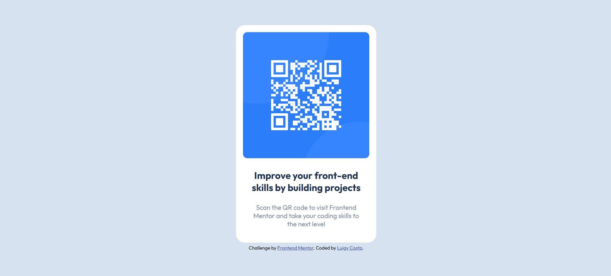

# Frontend Mentor - QR code component solution

This is a solution to the [QR code component challenge on Frontend Mentor](https://www.frontendmentor.io/challenges/qr-code-component-iux_sIO_H). Frontend Mentor challenges help you improve your coding skills by building realistic projects.

## Table of contents

- [Frontend Mentor - QR code component solution](#frontend-mentor---qr-code-component-solution)
  - [Table of contents](#table-of-contents)
  - [Overview](#overview)
    - [Screenshot](#screenshot)
    - [Links](#links)
    - [Built with](#built-with)
    - [Useful resources](#useful-resources)
  - [Author](#author)

## Overview

### Screenshot

### Links

- Solution URL: [https://www.frontendmentor.io/solutions/qr-code-component-in-html-and-css-qVq9funHCR](https://www.frontendmentor.io/solutions/qr-code-component-in-html-and-css-qVq9funHCR)
- Live Site URL: [https://luigy-costa.github.io/Frontend-Mentor-Solutions/blog-preview-card-main/](https://luigy-costa.github.io/Frontend-Mentor-Solutions/blog-preview-card-main/)

### Built with

- Semantic HTML5 markup
- CSS custom properties

### Useful resources

- [W3schools](https://www.w3schools.com/) - This helped me for XYZ reason. I really liked this pattern and will use it going forward.

## Author

- Website - [Luigy Costa](https://luigy-costa.github.io)
- Frontend Mentor - [@Luigy-Costa](https://www.frontendmentor.io/profile/Luigy-Costa)
- X - [@_LuigySantos_](https://x.com/_LuigySantos_)
- Github - [Luigy-Costa](https://github.com/Luigy-Costa)
